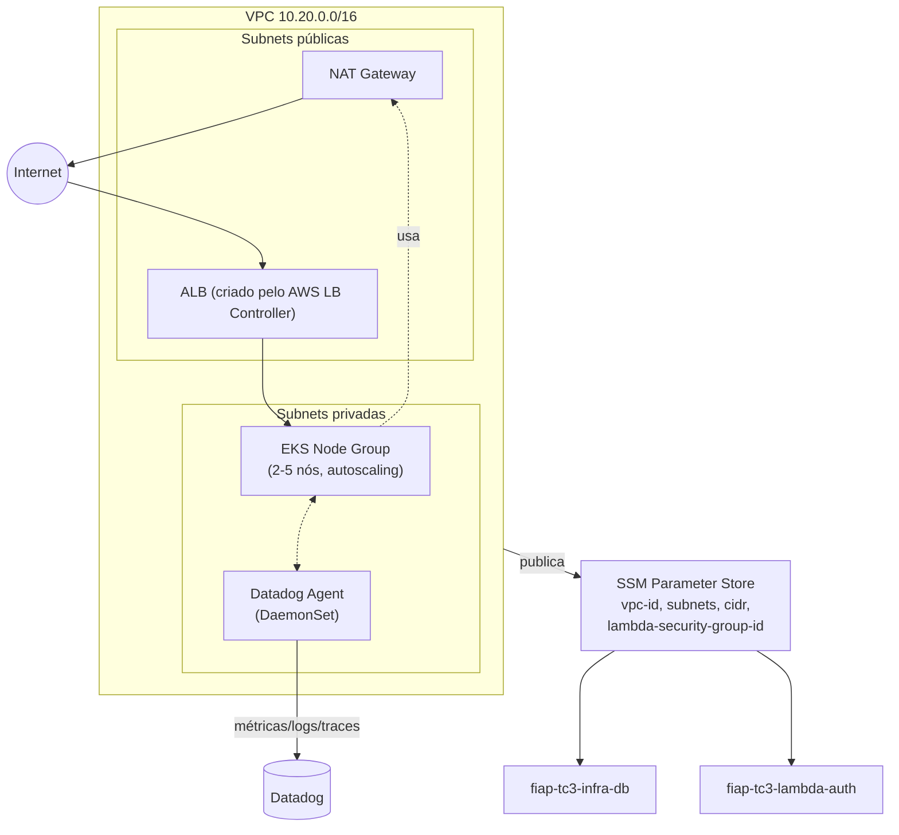

# fiap-tc3-infra-k8s

Infraestrutura como código (Terraform) do cluster Kubernetes do Tech Challenge Fase 3 (SOAT/FIAP). Repositório 2 dos 4 exigidos pelo desafio.

## Propósito

Provisionar a plataforma de execução da [aplicação principal](../fiap-TC1-oficina) em nuvem — substituindo o cluster `kind` local usado na Fase 2 por um **Amazon EKS** real, com escalabilidade de nós, rede privada para o RDS/Lambda, e a base de observabilidade (Datadog Agent) e roteamento externo (AWS Load Balancer Controller).

Este repositório é o **dono da rede**: cria a VPC, subnets públicas/privadas e NAT, e publica esses IDs no SSM Parameter Store para os repositórios [`fiap-tc3-infra-db`](../fiap-tc3-infra-db) e [`fiap-tc3-lambda-auth`](../fiap-tc3-lambda-auth) consumirem — por isso precisa ser aplicado **primeiro**, antes dos outros dois.

## Tecnologias

| Tecnologia | Finalidade |
|---|---|
| Terraform | Provisionamento declarativo |
| Amazon EKS | Cluster Kubernetes gerenciado |
| Node Group gerenciado (autoscaling 2–5 nós) | Escalabilidade de capacidade, complementar ao HPA da aplicação |
| AWS Load Balancer Controller (Helm) | Expõe a aplicação via ALB a partir de um `Service`/`Ingress` do Kubernetes |
| Datadog Agent (Helm, DaemonSet) | Métricas de nós/pods, logs e APM — consome os traces do `dd-java-agent` embarcado na imagem da aplicação |
| GitHub Actions | CI/CD |

## Arquitetura



## Deploy

Pré-requisitos: conta AWS, `terraform` >= 1.5, `helm`/`kubectl` (para inspeção pós-deploy).

```bash
cd terraform
terraform init
terraform apply -var="ambiente=homologacao" -var="datadog_api_key=<sua-chave-datadog>"
```

### AWS Academy Learner Lab

Este projeto roda hoje em uma conta do AWS Academy Learner Lab (usada pela FIAP), que impõe duas restrições que moldam este repositório:

- **Sem `iam:CreateRole`/`iam:AttachRolePolicy`/OIDC provider**: só é permitido `iam:PassRole` para a role pré-existente `LabRole`. Por isso o cluster EKS, o node group e o AWS Load Balancer Controller usam a `LabRole` diretamente (via IMDS com hop-limit 2, ver `eks.tf`/`alb-controller.tf`) em vez de roles dedicadas + IRSA.
- **Credenciais de sessão temporárias (~4h, via Vocareum "AWS Details")**: não há como o job `apply` do CI/CD assumir uma role via OIDC do GitHub Actions (exigiria criar role/OIDC provider, também bloqueado). Na prática, `terraform apply` é rodado localmente a cada sessão do lab, com as credenciais copiadas do painel do Learner Lab.

Depois de aplicado, exporte o kubeconfig para aplicar os manifestos da aplicação (repositório `fiap-TC1-oficina`):

```bash
aws eks update-kubeconfig --name $(terraform output -raw eks_cluster_name)
kubectl apply -f ../../fiap-TC1-oficina/k8s
```

O job `validate` do CI/CD (`terraform fmt` + `terraform validate`, com uma policy IAM vazia só para o parser não quebrar) roda em todo push/PR sem precisar de credenciais AWS. O job `apply` só roda quando a variável de repositório `DEPLOY_TO_AWS=true` estiver configurada — hoje ainda não está, porque a conta AWS do desafio está pendente de liberação de crédito pela FIAP. Segredos/variáveis necessários para habilitar: secrets `AWS_ROLE_ARN` (OIDC) e `DATADOG_API_KEY`; variável `AWS_REGION`.

Branch `main` protegida, merge só via Pull Request; push em `main` aplica em produção, push em `homologacao` aplica em homologação.

## Decisões relevantes

- Por que API Gateway não está neste repositório: o API Gateway do desafio roteia especificamente para a Function Serverless de autenticação, então vive em [`fiap-tc3-lambda-auth`](../fiap-tc3-lambda-auth) junto com a Lambda que ele expõe. A aplicação principal é exposta via ALB (Load Balancer Controller), não via API Gateway — ver ADR correspondente em `fiap-TC1-oficina/docs/`.
- Um único NAT Gateway (não um por AZ): reduz custo para o escopo do desafio; produção real teria um por AZ.
